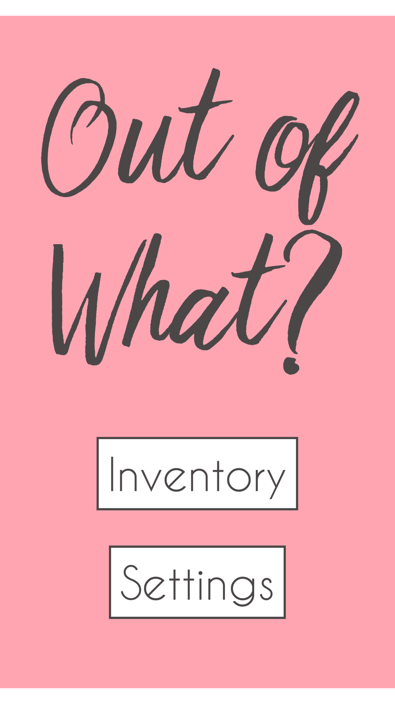
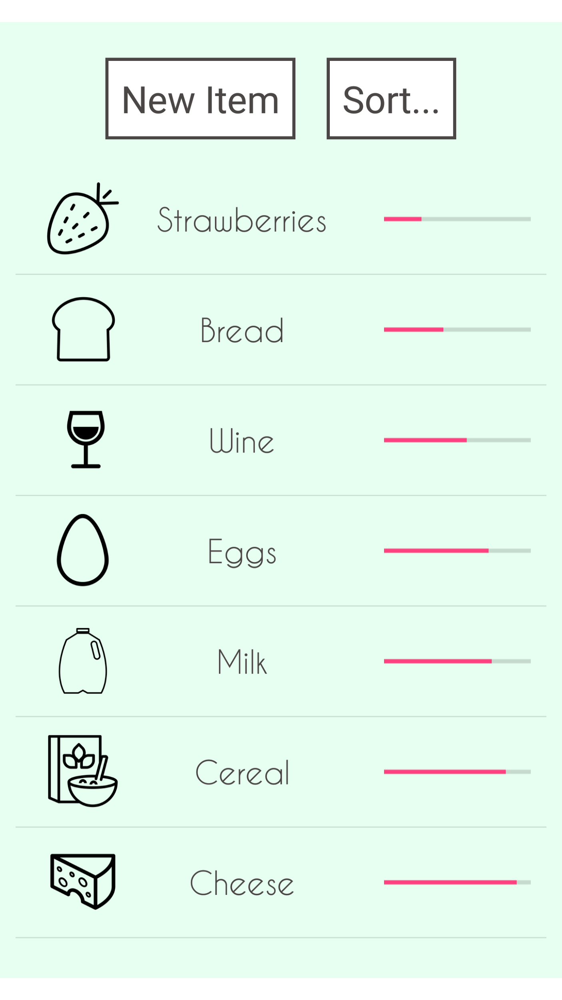
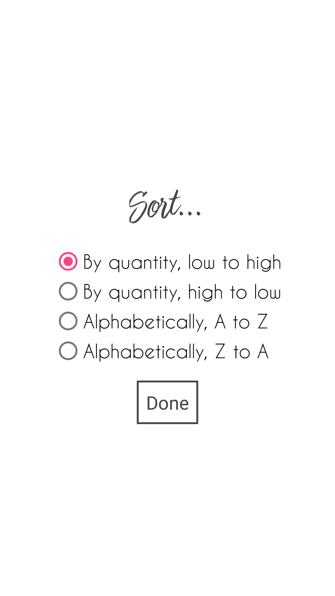
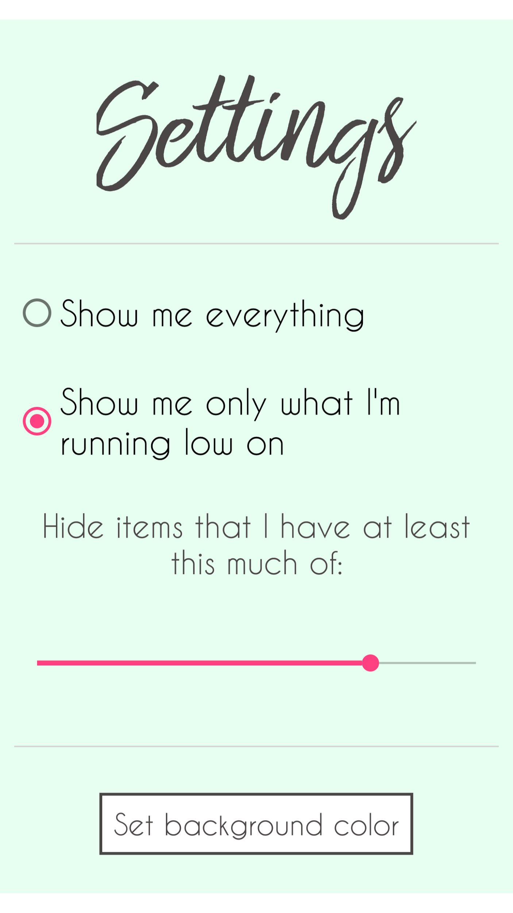
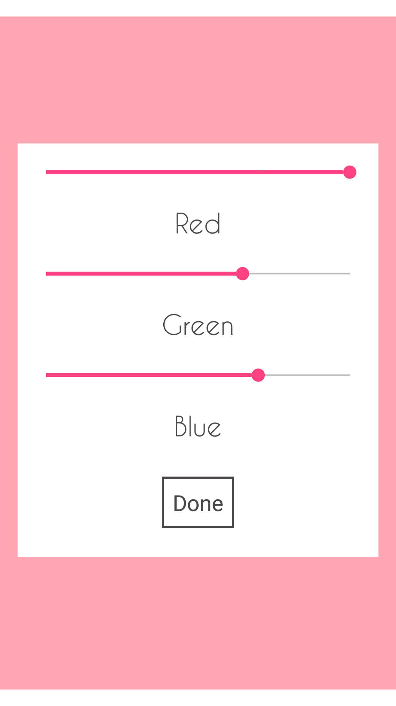

# Out of What?

#### Know what you have. Know what you don't.

---

## At a glance

**Out of What?** is a free Android application for keeping track of groceries, cleaning products, office supplies, and more.

The focus of the app is keeping things simple, visual, and easy to use.

---

Here is your inventory in **Out of What?**. Each item has its own icon, name, and quantity--all visible in one place.

---

## Key features:
- **Sort** your inventory alphabetically or by quantity
- Automatically **hide** things that you have a lot of, so you see just what you need
- Set a **custom** background color to use throughout the app

---

### Never write a shopping list again!

With **Out of What?**, your list is always in your pocket

---

# Get it!

You can download **Out of What?** for free on the Google Play store by clicking [this link](https://play.google.com/store/apps/details?id=commdgriest.httpsgithub.outofwhat).

---

# Moving forward

While I have decided not to release the source code for this application, your feedback and ideas for future improvements are as important to me as ever.

If you have questions, suggestions, or find issues while using the app, please send me an email at [mdgriest@crimson.ua.edu](mailto:mdgriest@crimson.ua.edu).

I created this application for free and on my own time, so I would like to see it be the best it can be!

Best as always,

[Mitchell Griest](https://github.com/mdgriest)
